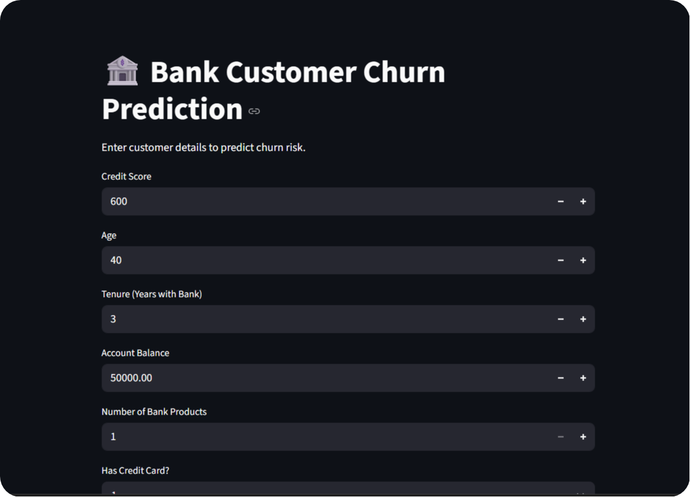

# 🏦 Bank Customer Churn Prediction

> Machine Learning powered web application to predict customer churn risk using Streamlit.

This project helps banks identify customers who are likely to leave the bank based on customer demographics, account details, and engagement metrics.

---

## ✨ Features

- 📊 Real-time churn prediction
- 🤖 Machine Learning classification model
- 🎯 Probability-based risk analysis
- 📈 Churn confidence score
- 🧠 Smart customer behavior analysis
- 🌐 Interactive Streamlit web app
- ⚡ Fast predictions using trained ML model
- 📱 Simple and responsive UI

---

## 🚀 Tech Stack

| Technology | Purpose |
|------------|---------|
| Python | Programming Language |
| Streamlit | Web Application |
| Scikit-learn | Machine Learning |
| Pandas | Data Processing |
| Joblib | Model Serialization |

---

## 📂 Project Structure

```bash
Bank-Churn-Prediction
│
├── app.py
├── churn_model.pkl
├── scaler.pkl
├── columns.pkl
├── requirements.txt
├── README.md
└── dataset.csv
```

---

## 🧠 Machine Learning Workflow

### 1️⃣ Data Preprocessing
- Handling categorical features
- One-hot encoding
- Feature scaling
- Column alignment

### 2️⃣ Model Training
- Customer churn classification
- Supervised learning approach
- Probability prediction

### 3️⃣ Prediction System
- Real-time input processing
- Scaled feature transformation
- Churn probability generation

---

## 📊 Input Features

| Feature | Description |
|---|---|
| Credit Score | Customer credit score |
| Age | Customer age |
| Tenure | Years with bank |
| Balance | Account balance |
| Number of Products | Bank products used |
| Credit Card | Has credit card or not |
| Active Member | Customer activity status |
| Estimated Salary | Annual estimated salary |
| Complaint Status | Customer complaint history |
| Satisfaction Score | Customer satisfaction rating |
| Reward Points | Loyalty points earned |
| Geography | Customer country |
| Gender | Customer gender |
| Card Type | Bank card category |

---

## ⚙ Installation

Clone the repository:

```bash
git clone https://github.com/your-username/Bank-Churn-Prediction.git
```

Navigate into project directory:

```bash
cd Bank-Churn-Prediction
```

Install dependencies:

```bash
pip install -r requirements.txt
```

Run Streamlit app:

```bash
streamlit run app.py
```

---

## 📸 Application Preview

Add screenshots here:

```md

```

---

## 🔍 Prediction Output

The model predicts:

- ✅ Customer likely to stay
- ⚠️ Customer likely to churn
- 📈 Churn probability score

Example:

```bash
Customer is likely to CHURN

Probability: 87%
```

---

## 📈 Model Features

- Feature scaling using StandardScaler
- One-hot encoded categorical variables
- Probability prediction with `predict_proba()`
- Consistent training column alignment

---

## 🌐 Streamlit UI Features

- Interactive form inputs
- Dropdown selections
- Sliders for ratings
- Real-time prediction button
- Probability progress bar
- Success/Error result cards

---

## 📦 Required Libraries

```bash
pip install streamlit pandas scikit-learn joblib
```

---

## 🔮 Future Improvements

- 📊 Churn analytics dashboard
- 📈 Data visualization charts
- ☁ Deployment on Streamlit Cloud
- 📧 Email alert system
- 🤖 Explainable AI predictions
- 📱 Mobile responsive UI
- 🧠 Deep Learning model integration

---

## 📄 License

This project is licensed under the MIT License.

---

## 👨‍💻 Author

Developed to analyze customer retention patterns and help banks reduce customer churn using Machine Learning.

---

## ⭐ Project Goal

The goal of this project is to help financial institutions proactively identify high-risk customers and improve customer retention strategies using predictive analytics.
